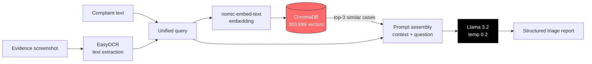

<div align="center">


# Cybercrime Triage AI

### Offline-first RAG that triages Indian cybercrime complaints from text *and* screenshots

Grounded in **300,999 historical cases** · Runs entirely on local hardware · **Zero third-party API calls**

<br/>

[](https://www.python.org/)
[](https://fastapi.tiangolo.com/)
[](https://www.langchain.com/)
[](https://www.trychroma.com/)
[](https://ollama.com/)
[](https://react.dev/)
[](https://tailwindcss.com/)

<br/>

**[Problem](#the-problem)** · **[Architecture](#architecture)** · **[Features](#features)** · **[Quickstart](#getting-started)** · **[API](#api-reference)** · **[Engineering notes](#engineering-notes)**

</div>

<!--
  SCREENSHOTS — highest-impact addition to this README.
  Drop images in docs/ and uncomment:

<div align="center">
  
  <br/><em>Complaint intake with drag-and-drop evidence upload, and the generated triage report</em>
</div>
-->

<div align="center">
<table>
<tr>
<td align="center" width="150"><h3>300,999</h3><sub>complaints indexed</sub></td>
<td align="center" width="150"><h3>13</h3><sub>metadata fields<br/>per vector</sub></td>
<td align="center" width="150"><h3>0</h3><sub>external API calls</sub></td>
<td align="center" width="150"><h3>2</h3><sub>input modalities<br/>text + image</sub></td>
</tr>
</table>
</div>

---

## The problem

India's National Cybercrime Reporting Portal receives complaints faster than human
officers can classify and route them. Each complaint arrives as unstructured prose —
often with a screenshot of the fraudulent message attached — and must be assigned a
threat category, mapped to a legal provision, and routed to the right department before
anyone can act on it. The delay between filing and triage is exactly the window in which
transferred funds become unrecoverable.

## The solution

This system takes a victim's narrative and any evidence screenshot, finds the most
similar complaints among 300,999 historical records via semantic search, and grounds a
local LLM in those precedents to produce a structured triage report:

1. **Threat Classification**
2. **Potential Legal / Regulatory Category**
3. **Actionable Mitigation Steps for the Victim**

Because retrieval is grounded in real prior complaints rather than the model's own
parametric memory, the output reflects how comparable cases were actually categorised.

<table>
<tr><td>

**In** — a complaint filed in plain language

> *"Victim received a call from someone posing as a bank official asking to complete KYC. They shared an OTP and ₹48,000 was debited via UPI to an unknown account."*

</td></tr>
<tr><td>

**Out** — a structured triage report, grounded in the 3 most similar historical cases

> **1. Threat Classification**
> Vishing (voice phishing) escalating to unauthorised UPI transfer via OTP compromise. Social-engineering vector: impersonation of a banking official under a KYC pretext.
>
> **2. Potential Legal / Regulatory Category**
> Cheating by personation and identity theft under the IT Act; RBI unauthorised-electronic-transaction provisions apply to the liability window.
>
> **3. Actionable Mitigation Steps**
> Report to 1930 / cybercrime.gov.in within the golden hour · request beneficiary-account freeze · file a written dispute with the issuing bank · preserve call records and the SMS debit alert.

</td></tr>
</table>

<sub>Illustrative of the response shape. Actual wording is generated at request time from retrieved precedent.</sub>

### Why fully local matters here

Cybercrime complaints contain victim names, cities, transaction amounts, and account
identifiers. This pipeline sends **zero data to any third-party API** — embeddings,
inference, and OCR all run on-device via Ollama and EasyOCR. That is a hard requirement
for handling this class of PII, not a cost optimisation.

---

## Architecture



**Request path:** `POST /api/v1/analyze` → `analyze_router` merges text + OCR output →
`rag_service` retrieves and invokes the LCEL chain → `AnalysisResponse` returned to the
React client.

---

## Features

| Capability | What it does |
| --- | --- |
| **Multimodal intake** | Accepts a text narrative, an evidence screenshot, or both. OCR output is concatenated into the retrieval query so text baked into an image is searchable. |
| **Semantic retrieval over 300k cases** | ChromaDB similarity search returns the top 3 comparable complaints as grounding context. |
| **Rich metadata per vector** | 13 fields — category, sub-category, severity, priority, amount lost, platform, routing department, jurisdiction, and more — stored alongside every embedding, enabling future filtered retrieval. |
| **Fully offline inference** | Llama 3.2 and `nomic-embed-text` served by Ollama; EasyOCR runs locally. No external API calls. |
| **Resumable bulk ingestion** | The 300k-row build checkpoints after every batch, retries on embedding-service failures with backoff, and resumes mid-file after an interruption. |
| **Fail-fast startup** | The API refuses to boot against a missing or empty collection instead of silently returning zero matches — a config typo surfaces immediately. |
| **Production-shaped API** | FastAPI with Pydantic response models, CORS for the Vite dev server, and auto-generated OpenAPI docs. |
| **Purpose-built UI** | React dashboard with drag-and-drop evidence upload, image preview, loading states, and structured rendering of the model's report. |

---

## Tech stack

| Layer | Technology |
| --- | --- |
| API | FastAPI, Uvicorn, Pydantic v2 |
| RAG orchestration | LangChain (LCEL), `langchain-chroma`, `langchain-ollama` |
| Vector store | ChromaDB (SQLite persistence, HNSW index) |
| Embeddings | `nomic-embed-text` via Ollama |
| LLM | Llama 3.2 via Ollama (`temperature=0.2`) |
| OCR | EasyOCR (PyTorch backend) |
| Frontend | React 18, Vite 6, Tailwind CSS 4, React Router 6 |

---

## Getting started

### Prerequisites

- **Python 3.12** (see `.python-version`)
- **Node 18+**
- **[Ollama](https://ollama.com)** running locally, with both models pulled:

  ```bash
  ollama pull nomic-embed-text
  ollama pull llama3.2
  ollama list          # confirm both appear
  ```

### 1. Install

```bash
git clone https://github.com/sridarsh7858/cybercrime-triage-rag.git
cd cybercrime-triage-rag

python -m venv .venv
.venv\Scripts\activate          # Windows
# source .venv/bin/activate     # macOS / Linux

pip install -r requirements.txt
```

### 2. Build the vector store — required before first run

> **The index is not in this repository.** It is ~1.8 GB of generated files, well past
> GitHub's 100 MB per-file limit, so `data/` is gitignored and the store is built
> locally. The API loads it at import time and raises `RuntimeError` if it is missing,
> so this step cannot be skipped.

Place a complaints CSV in `data/`, then:

```bash
# Quick verification run — a few minutes, confirms Ollama is reachable
python scripts/build_db.py --csv "data/your-complaints.csv" --max-rows 5000

# Full build — several hours on CPU for 300k rows
python scripts/build_db.py --csv "data/your-complaints.csv"
```

Output lands in `data/ChromaDB_Indian/`, which is where `app/core/config.py` expects it.

<details>
<summary><b>Expected CSV schema</b></summary>

One content column — **`complaint_text`** — is embedded and searched. These columns are
stored as metadata alongside each vector:

`complaint_id` · `primary_category` · `sub_category` · `severity_level` · `priority` ·
`amount_lost` · `platform` · `routing_department` · `jurisdiction` · `keywords` ·
`incident_date` · `user_name` · `user_city`

Missing metadata columns are tolerated; a missing `complaint_text` column is not.

</details>

<details>
<summary><b>Ingestion options</b></summary>

| Flag | Purpose |
| --- | --- |
| `--csv PATH` | Source CSV (default `data/cybercrime_complaints_300k_fixed.csv`) |
| `--db-dir PATH` | Persist location (default `data/ChromaDB_Indian`) |
| `--max-rows N` | Ingest only the first N rows |
| `--batch-size N` | Documents per embedding request (default 200) |
| `--fresh` | Delete any existing store and rebuild from row 0 |

**Resumability:** progress is written to `data/ChromaDB_Indian/ingest_checkpoint.json`
after every batch. Re-running the same command after an interruption picks up where it
stopped. Documents are split at 500 characters with 50-character overlap and embedded in
batches of 200 — Ollama's runner is unstable when handed thousands of texts at once —
with exponential backoff on failure.

</details>

### 3. Run the backend

```bash
uvicorn app.main:app --reload
```

A healthy startup prints:

```
[ocr] Initializing EasyOCR Engine...
[chroma] Connecting to existing SQLite ChromaDB at: .../data/ChromaDB_Indian
[chroma] Collection 'langchain' ready with 300999 documents
```

- Health check → <http://localhost:8000/health>
- Interactive OpenAPI docs → <http://localhost:8000/docs>

### 4. Run the frontend

```bash
cd frontend
npm install
cp .env.example .env          # VITE_API_URL — defaults to http://localhost:8000
npm run dev
```

Open <http://localhost:5173>. Sign in with any username to reach the dashboard, paste a
complaint (or click **Insert sample**), optionally drop in a screenshot, and hit **Run
Triage Analysis**.

---

## API reference

### `POST /api/v1/analyze`

Multipart form. At least one of the two fields is required.

| Field | Type | Description |
| --- | --- | --- |
| `query` | string | The complaint narrative |
| `file` | image | Evidence screenshot (PNG / JPG / WEBP) |

```bash
curl -X POST http://localhost:8000/api/v1/analyze \
  -F "query=Victim received a call from someone posing as a bank official asking to complete KYC. They shared an OTP and ₹48,000 was debited via UPI." \
  -F "file=@evidence.png"
```

```json
{
  "query": "Victim received a call from someone posing as a bank official...",
  "analysis": "1. Threat Classification\nVishing / UPI fraud with OTP compromise...",
  "retrieved_context_count": 3
}
```

`400` if neither field is supplied · `500` on OCR or inference failure.

### `GET /health`

```json
{ "status": "online", "database": "ChromaDB SQLite Connected" }
```

---

## Project structure

```
app/
  api/analyze_router.py      Multipart intake, OCR + text merge, error mapping
  core/config.py             Paths, model names, collection name
  schemas/                   Pydantic request/response contracts
  services/
    chroma_service.py        Vector store connection + similarity search
    rag_service.py           Prompt template and LCEL chain
    ocr_service.py           EasyOCR wrapper
frontend/
  src/pages/Dashboard.jsx    Intake form + triage report rendering
  src/api/client.js          Backend client
scripts/
  build_db.py                Resumable CSV → ChromaDB ingestion
data/                        Gitignored — CSVs, generated index, temp uploads
```

---

## Engineering notes

Decisions worth calling out for anyone reading the source:

- **Fail loudly on an empty collection.** LangChain's Chroma wrapper silently creates an
  empty collection when the requested name doesn't exist, which turns a config typo into
  "0 similar matches" rather than an error. `chroma_service.py` asserts a non-zero count
  at import and lists the available collections in the failure message.
- **Explicit UTF-8 on CSV load.** `CSVLoader` otherwise opens files with the Windows
  locale encoding and mangles `₹` and other non-ASCII characters — silently corrupting
  every amount field in the corpus.
- **Metadata coercion before insert.** Chroma accepts only `str`/`int`/`float`/`bool`;
  everything else is coerced and `None` becomes `""` so a single malformed row can't
  abort a multi-hour ingest.
- **Batched embedding with retry.** Ollama's model runner drops connections under large
  batches, so documents are embedded 200 at a time with backoff — the difference between
  a 300k-row build finishing and failing at hour three.
- **Checkpointing at batch granularity.** Row-level progress is persisted continuously,
  making the ingest interruptible on consumer hardware.
- **Low temperature (0.2).** Triage output feeds a legal/routing decision; consistency
  matters more than fluency.

---

## Limitations & roadmap

Stated plainly — this is a working prototype, not a deployed system:

- **Authentication is demo-only.** The login screen accepts any username and persists to
  `localStorage`; there is no backend auth, session validation, or user store. Real
  deployment needs proper identity before anything else.
- **Retrieval is unfiltered.** The 13 metadata fields are indexed but not yet used for
  filtered search — restricting by `jurisdiction` or `primary_category` would sharpen
  results considerably.
- **No evaluation harness.** Retrieval quality and classification accuracy are assessed
  qualitatively. A labelled test set with recall@k and category-accuracy metrics is the
  most valuable next addition.
- **OCR is English-only.** `easyocr.Reader(['en'])` — Indian-language screenshots are
  not yet handled.
- **Uploads are transient.** No case persistence, audit trail, or report export.
- **Single-process, synchronous.** Inference blocks the request; a task queue would be
  needed for real concurrency.

Planned next: metadata-filtered retrieval, a labelled evaluation set, streaming
responses, and containerised deployment.

---

## Acknowledgements

Built with [LangChain](https://www.langchain.com/),
[ChromaDB](https://www.trychroma.com/), [Ollama](https://ollama.com/), and
[EasyOCR](https://github.com/JaidedAI/EasyOCR).
